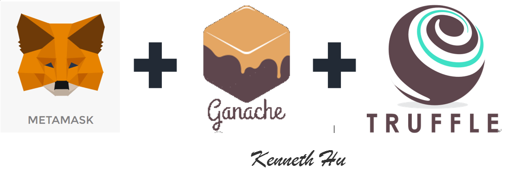

# Blockchain

## Autores

  Pablo García Llorente
  Eugenio Alcántara García
  

## Índice

  ####   1. ¿Qué es blockchain?
  
  ####   2. Nuestro proyecto
  #####     2.1. ¿Qué es una dApp?
  
  ####   3. Ventajas e inconvenientes de la tecnología blockchain 
  
  ####   4. ¿Qué son los contratos inteligentes?
  
  ####   5. Hyperledger y Ethereum
  
  ####   6. Instalación de las herramientas de desarrollo
  #####     6.1. Node Package Manager
  #####     6.2. Truffle Framework
  ######    6.2.1. Ganache
  #####     6.3. Metamask
  
  ####   7. Nuestra primera aplicación
  
  ####   8. Desarrollo de la aplicación
  
  ####   9. Bibliografía
  
##   1. ¿Qué es blockchain?

Blockchain es una base de datos descentralizada que almacena un registro de activos y transacciones en un red Peer-to-Peer (o P2P). Describiéndolo de una forma sencilla, es un libro contable que registra quién posee qué y quién negocia con qué. Las transacciones son aseguradas a través del uso de criptografía. Los bloques, que agrupan transacciones, son asegurados con criptografía también y enlazados en una secuencia temporal creando un registro inmutable. Este registro es replicado en cada ordenador que usa la red lo que hace que sea extremadamente complicado de manipular a diferencia de una base de datos controlado por una única entidad o autoridad central.

Blockchain surgió y se popularizó a partir de las cryptomonedas, más específicamente Bitcoin. Pero esta tecnología puede ser usada con otros muchos tipos de activos digitales: certificados, títulos, contratos, nuevos activos digitales o cualquier activo del mundo real representado de forma inequívoca con su representación digital, incluida la información personal.

Blockchain permite el compartir la información de forma clara y segura, permitiendo a los usuarios confiar en la tecnología y que sus activos están asegurados en ella. Existen múltiples tipos de blockchain dependiendo de su accesibilidad, puede ser pública, como Ethereum o Bitcoin, en las cuales todo el mundo puede unirse, o privada, como Hyperledger o Quorum, que requieren la aprobación de los participantes para poder acceder.
  
##   2. Nuestro proyecto

 
##   3. Ventajas e inconvenientes de la tecnología blockchain  

La información está descentralizada, esto es una ventaja e inconveniente a la vez ya que la información es segura y dificil de borrar o modificar por quien no debería pero en el caso de contener una gran cantidad de información esto puede causar problemas a los usuarios.

Es robusto, al ser redundante tiene una tolerancia a fallos muy alta, ningún nodo es crucial para el registro de transacciones, aunque un nodo no esté disponible el resto seguirá funcionando, y si este nodo quiere sincronizarse puede hacerlo fácilmente obteniendo la información de otros nodos.

La visibilidad de la información es una ventaja y un inconveniente, ya que en algunas aplicaciones que todas las operaciones sean visibles por todos los usuarios, como con las cryptomonedas, esto es una ventaja pero pueden existir otras que requieran absoluta privacidad en las transacciones, limitando el uso de blockchain en ellas.

El uso de blockchain requiere más operaciones que en el caso de una base de datos centralizada, sobre todo esto se dispara cuanta más seguridad se utiliza.

Para finalizar includo un gráfico que nos da una idea de cuándo puede se útil utilizar blockchain y que tipo utilizar.
  

  
##   4. ¿Qué son los contratos inteligentes?

  
##   5. Ethereum

  
##   6. Instalación de las herramientas de desarrollo

### 6.1. Node Package Manager(NPM)

La primera herramienta que debemos instalar en nuestro sistema es el Node Package Manager(NPM) que viene con Node.js. Node Package Manager es un gestor de paquetes, el cual simplificará el proceso de trabajar con Node, ya que gracias a él podremos tener cualquier librería disponible con una línea de código. NPM nos ayudrá a administrar nuestros módulos, distribuir paqutes y agregar dependencias de forma sencilla. 

Este paquete se puede descargar desde https://nodejs.org/en/, como podemos ver en la siguiente imagen, se debe tener en cuenta que nosotros hemos realizado la aplicación en un Mac pero las imagenes las hemos tomado desde un Windows.

Para comprobar que se ha instalado correctamente ejecutamos el siguiente comando, que muestra la versión de nodejs instalada, desde la terminal:

     $ node -v
         
###     6.2. Truffle Framework

Truffle es el framework más popular para el desarrollo de Ethereum hoy en día. Este nos ofrece:

  -Compilación, enlace y despigue de contratos inteligentes desde el propio Truffle.
  -Depuración y testing automatizado de contratos.
  -Scripts de despliegue y migraciones en redes públicas y privadas.
  -Acceso a cientos de paquetes externos y gestión con EthPM y NPM.
  -Consola interactiva para comunicación directa con los contratos.
  -Interacción con contratos mediante scripts externos.
  
Todo esto lo veremos a lo largo del desarrollo del proyecto. Para instalar truffle requerimos de NPM, el cual hemos instalado previamente, en la terminal escribiremos el siguiente comando:

    $ npm install -g truffle

####    6.2.1. Ganache

###     6.3. Metamask

MetaMask es la forma más fácil de interactuar con dApps en el navegador. Es una extensión de Chrome o Firefox que conecta a una red de Ethereum sin ejecutar un nodo completo en el navegador de la máquina. Puede conectar a la red principal de Ethereum, cualquiera de sus redes de prueba (Ropsten, Kovan, y Rinkeby), o una blockchain local, como será la nuestra, creada por Ganache. Para el desarrollo con Truffle, esto significa que podremos utilizar nuestra dApp de la misma forma que los usuarios interactuarán con una red en vivo.

Para instalar Metamask debemos seguir el siguiente enlace: https://metamask.io/ y añadir la extensión al navegador de nuestra elección (Chrome o Firefox). Explicaremos la utilización de Metamask más extensivamente a lo largo del desarrollo de la aplicación.
  
   
  
##   7. Nuestra primera aplicación

  
##   8. Desarrollo de la aplicación

##   9. Bibliografía

https://criptomonedasybitcoin.com/contratos-inteligentes/

https://criptomonedasybitcoin.com/la-blockchain-a-fondo/

https://devcode.la/blog/que-es-npm/

https://metamask.io/

https://www.youtube.com/watch?v=ZIGUC9JAAw8

https://truffleframework.com/docs/truffle/overview

https://aprendeblockchain.wordpress.com/desarrollo-en-ethereum/desarrollo-con-truffle-i/

https://truffleframework.com/docs/ganache/overview

https://www.ethereum.org/

https://www.hyperledger.org/

https://solidity.readthedocs.io/en/v0.5.8/

www.dappuniversity.com/articles/the-ultimate-ethereum-dapp-tutorial

https://www.youtube.com/watch?v=3681ZYbDSSk

https://medium.com/coinmonks/developing-ethereum-dapps-with-truffle-ganache-and-metamask-31bc5023ce91

