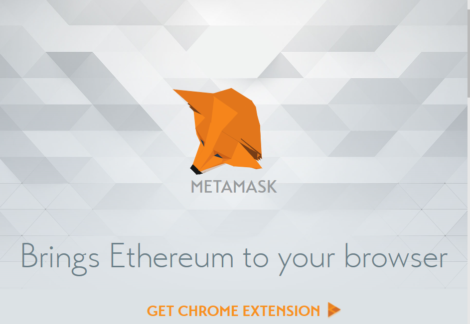

# Blockchain

## Autores

  Pablo García Llorente
  Eugenio Alcántara García
  
## Índice

  ####   -1. ¿Qué es blockchain?
  
  ####   -2. Nuestro proyecto
  #####     -- ¿Qué es una dApp?
  
  ####   -3. Ventajas e inconvenientes de la tecnología blockchain 
  
  ####   -4. ¿Qué son los contratos inteligentes?
  
  ####   -5. Ethereum
  #####     -- ¿Qué es Ethereum?
  #####     -- ¿Qué es el Ether?
  #####     -- ¿Qué es el Gas?
  
  ####   -6. Instalación de las herramientas de desarrollo
  #####     -- Node Package Manager
  #####     -- Truffle Framework
  ######    --- Ganache
  #####     -- Metamask
  
  ####   -7. Nuestra primera aplicación
  
  ####   -8. Desarrollo de la aplicación
  
  ####   -9. Bibliografía
  
##   1. ¿Qué es blockchain?

Blockchain es una base de datos descentralizada que almacena un registro de activos y transacciones en un red Peer-to-Peer (o P2P). Describiéndolo de una forma sencilla, es un libro contable que registra quién posee qué y quién negocia con qué. Las transacciones son aseguradas a través del uso de criptografía. Los bloques, que agrupan transacciones, son asegurados con criptografía también y enlazados en una secuencia temporal creando un registro inmutable. Este registro es replicado en cada ordenador que usa la red lo que hace que sea extremadamente complicado de manipular a diferencia de una base de datos controlado por una única entidad o autoridad central.

Blockchain surgió y se popularizó a partir de las cryptomonedas, más específicamente Bitcoin. Pero esta tecnología puede ser usada con otros muchos tipos de activos digitales: certificados, títulos, contratos, nuevos activos digitales o cualquier activo del mundo real representado de forma inequívoca con su representación digital, incluida la información personal.

Blockchain permite el compartir la información de forma clara y segura, permitiendo a los usuarios confiar en la tecnología y que sus activos están asegurados en ella. Existen múltiples tipos de blockchain dependiendo de su accesibilidad, puede ser pública, como Ethereum o Bitcoin, en las cuales todo el mundo puede unirse, los unicos requisitos son un ordenador y acceso a Internet, privada, como Hyperledger o Quorum, que requieren la aprobación de los participantes para poder acceder, o híbridas, que son una combinación de las públicas y las privadas, en ellas los nodos participantes son elegidos o restringidos por una persona o grupo de personas pero todas las transacciones son públicas.

  
##   2. Nuestro proyecto

Hemos decidido crear un sistema de votación a través de la Blockchain. Si en vez de hacerlo en la blockchain, lo hiciésemos en una aplicación en la web tendríamos una seria de problemas tales como:

    - Los datos podrían ser cambiados en la base de datos.
    - El código fuente de la aplicación podría ser cambiado también en cualquier momento. 
    
Queremos hacerla en la Blockchain, donde cualquier persona conectada a la web pueda participar en la votación. Nos tenemos que asegurar de que sus votos sean contabilizados y que solo sean contados una vez. 

En vez de tener una red, un servidor central y una base da datos. La Blockchain es una red y una base de datos todo en uno. La Blockchain es una red peer to peer de ordenadores las cualres se les llama nodos. Estos comparten todos los datos y el código en la red. De modo que si un dispistivo se conecta a la red, formaría parte de la red siendo un nodo y se comunicaría con todos los nodos de cómputo de la red. Este dispositivo pasaría a tener una copia de los datos y el código de la Blockchain. Por lo que ya no tenemos más servidores centrales, tan solo un grupo de ordenadores que se comunican entre si en la misma red. 

Todas los datos de las transacciones que es compartido a través de los nodos de la blockchain está contenido en lo que se denomina bloque, que están encadenadoes entre si en un libro. Todos los datos se encuentran de forma pública en lo que hemos denominado 'libro' bien seguros con un hash criptográfico. Los nodos que hemos mencionado anterioremnte se aseguran de que todas las copias de los datos distribuidas a través de la red sean idénticas. Esta es una razón muy de peso por la que hemos decidido realizar una aplicación para votar a través de una cadena de bloques. 

Para poder votar en nuestra aplicación, el usuario debe de tener lo que se denomina como 'wallet', es decir, cartera. En esta debe debe de tener una cuenta con Ether, la criptomoneda de Ethereum. Una vez estén conectados a la web, podrán realizar su voto pagando una pequeña comisión para escribir la transacción en la Blockchain. Esta comisión en el caso de la Blockchain de Ethereum se denomina 'GAS'. Cuando la transacción se haya creado, algunos de los nodos de la red llamados 'mineros' verificarán esta transacción y será completada. Una vez hecho este proceso, el voto habrá quedado realizado. 
 
##   3. Ventajas e inconvenientes de la tecnología blockchain  

La información está descentralizada, esto es una ventaja e inconveniente a la vez ya que la información es segura y dificil de borrar o modificar por quien no debería pero en el caso de contener una gran cantidad de información esto puede causar problemas a los usuarios.

Es robusto, al ser redundante tiene una tolerancia a fallos muy alta, ningún nodo es crucial para el registro de transacciones, aunque un nodo no esté disponible el resto seguirá funcionando, y si este nodo quiere sincronizarse puede hacerlo fácilmente obteniendo la información de otros nodos.

La visibilidad de la información es una ventaja y un inconveniente, ya que en algunas aplicaciones que todas las operaciones sean visibles por todos los usuarios, como con las cryptomonedas, esto es una ventaja pero pueden existir otras que requieran absoluta privacidad en las transacciones, limitando el uso de blockchain en ellas.

El uso de blockchain requiere más operaciones que en el caso de una base de datos centralizada, sobre todo esto se dispara cuanta más seguridad se utiliza.

Para finalizar includo un gráfico que nos da una idea de cuándo puede se útil utilizar blockchain y que tipo utilizar.
  

  
##   4. ¿Qué son los contratos inteligentes?

Los contratos inteligentes son programas informáticos que se asientan sobre una cadena de bloques, en el cual son programadas unas condiciones de actuación y se ejecutan en el momento que estas se cumplen. En otras palabras, es un programa informático que vincula a las partes involucradas forzando el cumplimento de las reglas establecidas de forma automatizada y descentralizada.

Tal y como heos mencionado anteriormente, los contratos inteligentes funcionan automáticamente ejecutando unas actuaciones predefinidas en su código en el momento que estas se cumplen. Tal y como podemos ver en la imagen a continuación.

    
##   5. Ethereum

    

###  ¿Qué es Ethereum?

Ethereum es una plataforma blockchain descentralizada que nos permite construir aplicaciones donde el Ether es la moneda utilizada para pagar por el uso de recursos en la red, las aplicaciones creadas creadas mediante el uso de Ethereum buscan ser fáciles de desarrollar, seguras e interactivas con otras aplicaciones. Esto se consigue a partir de una blockchain con un lenguaje de programación Turing-completo, permitiendo a cualquiera escribir contratos inteligentes y aplicaciones independientes accesibles a todo el mundo.

Como hemos mencionado antes, el uso de la red Ethereum requiere que el usuario, en el caso de querer modificar información, utilice recursos en forma de Ether, de la cual hablaremos con más profundidad a continuación, esto significa que si quisiéramos hacer nuestra aplicación pública en la red de Ethereum, se requeriría dinero, por lo tanto ejecutaremos nuestra aplicación en modo local desde el navegador en la dirección http://localhost:8000 gracias a Truffle, Ganache y Metamask, herramientas que comentaremos más adelante.

### ¿Qué es el Ether?

Ether es la cryptomoneda de Ethereum, es utilizada por los clientes de la plataforma ethereum para realizar pagos a otras personas o a máquinas que ejecutan operaciones solicitadas. Es decir, ether es el incentivo que asegura que los desarrolladores escriban aplicaciones de calidad (la codificación innecesaria cuesta más) y que la red permanezca saludable (la gente es recompensada por los recursos aportados).

Aquí podemos ver una gráfica con los precios de Ether a lo largo del tiempo:

### ¿Qué es el Gas?

Con el fin de evitar bucles infinitos accidentales, hostiles, u otro desperdicio computacional en el código, cada transacción es obligada a establecer un límite al número de pasos computacionales de ejecución de código.

El Gas es el coste que tiene el realizar una operación o un conjunto de operaciones en la red Ethereum. Estas operaciones pueden ser varias: desde realizar una transacción hasta ejecutar un contrato inteligente o crear una aplicación descentralizada.

Al igual que en el mundo físico, en Ethereum también hay trabajos que cuestan más que otros. Si la operación que queremos realizar requiere un mayor uso de recursos por parte de los nodos que forman la plataforma, esto hará que el Gas aumente también.
  
##   6. Instalación de las herramientas de desarrollo

### Node Package Manager(NPM)

La primera herramienta que debemos instalar en nuestro sistema es el Node Package Manager(NPM) que viene con Node.js. Node Package Manager es un gestor de paquetes, el cual simplificará el proceso de trabajar con Node, ya que gracias a él podremos tener cualquier librería disponible con una línea de código. NPM nos ayudará a administrar nuestros módulos, distribuir paqutes y agregar dependencias de forma sencilla. 

Este paquete se puede descargar desde https://nodejs.org/en/, como podemos ver en la siguiente imagen, se debe tener en cuenta que nosotros hemos realizado la aplicación en un Mac pero las imagenes las hemos tomado desde un Windows.

Para comprobar que se ha instalado correctamente ejecutamos el siguiente comando, que muestra la versión de nodejs instalada, desde la terminal:

     $ node -v
         
### Truffle Framework

Truffle es el framework más popular para el desarrollo de Ethereum hoy en día. Este nos ofrece:

  -Compilación, enlace y despigue de contratos inteligentes desde el propio Truffle.
  -Depuración y testing automatizado de contratos.
  -Scripts de despliegue y migraciones en redes públicas y privadas.
  -Acceso a cientos de paquetes externos y gestión con EthPM y NPM.
  -Consola interactiva para comunicación directa con los contratos.
  -Interacción con contratos mediante scripts externos.
  
Todo esto lo veremos a lo largo del desarrollo del proyecto. Para instalar Truffle requerimos de NPM, el cual hemos instalado previamente, en la terminal escribiremos el siguiente comando:

    $ npm install -g truffle

#### Ganache

La página oficial de Ganache, https://truffleframework.com/ganache, lo describe como blockchain en un click, crea una blockchain de Ethereum rápidamente que te permita probar, ejecutar comandos, e inspeccionar el estado mientras controlas como funciona la cadena.

Ganache te permite visualizar la información de las cuentas, su estado, incluyendo sus direcciones, claves privadas, transacciones y balances, ver el log de la blockchain interna de Ganache, incluyendo las respuestas y otra información vital para la corrección de errores. También incluye controles avanzados de minería, un navegador que permite examinar todos los bloques y transacciones para obtener conocimiento sobre lo que ocurre.

A continuación podemos ver la interfaz de Ganache con las cuentas que hemos utilizado para nuestra aplicación.

### Metamask

MetaMask es la forma más fácil de interactuar con dApps en el navegador. Es una extensión de Chrome o Firefox que conecta a una red de Ethereum sin ejecutar un nodo completo en el navegador de la máquina. Puede conectar a la red principal de Ethereum, cualquiera de sus redes de prueba (Ropsten, Kovan, y Rinkeby), o una blockchain local, como será la nuestra, creada por Ganache. Para el desarrollo con Truffle, esto significa que podremos utilizar nuestra dApp de la misma forma que los usuarios interactuarán con una red en vivo.

Para instalar Metamask debemos seguir el siguiente enlace: https://metamask.io/ y añadir la extensión al navegador de nuestra elección (Chrome o Firefox). Explicaremos la utilización de Metamask más extensivamente a lo largo del desarrollo de la aplicación.
  
   
  
##   7. Nuestra primera aplicación

  
##   8. Desarrollo de la aplicación

##   9. Bibliografía

https://www.lis-solutions.es/blog/blockchain_contratos_inteligentes/

https://dtecdeal.com/guia-simple-blockchain/

https://criptomonedasybitcoin.com/contratos-inteligentes/

https://criptomonedasybitcoin.com/la-blockchain-a-fondo/

https://devcode.la/blog/que-es-npm/

https://metamask.io/

https://www.youtube.com/watch?v=ZIGUC9JAAw8

https://truffleframework.com/docs/truffle/overview

https://aprendeblockchain.wordpress.com/desarrollo-en-ethereum/desarrollo-con-truffle-i/

https://truffleframework.com/docs/ganache/overview

https://www.ethereum.org/

https://solidity.readthedocs.io/en/v0.5.8/

www.dappuniversity.com/articles/the-ultimate-ethereum-dapp-tutorial

https://www.youtube.com/watch?v=3681ZYbDSSk

https://medium.com/coinmonks/developing-ethereum-dapps-with-truffle-ganache-and-metamask-31bc5023ce91

