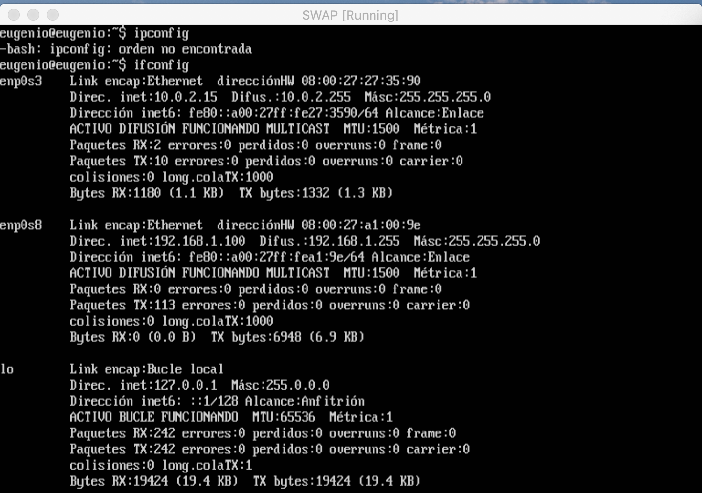
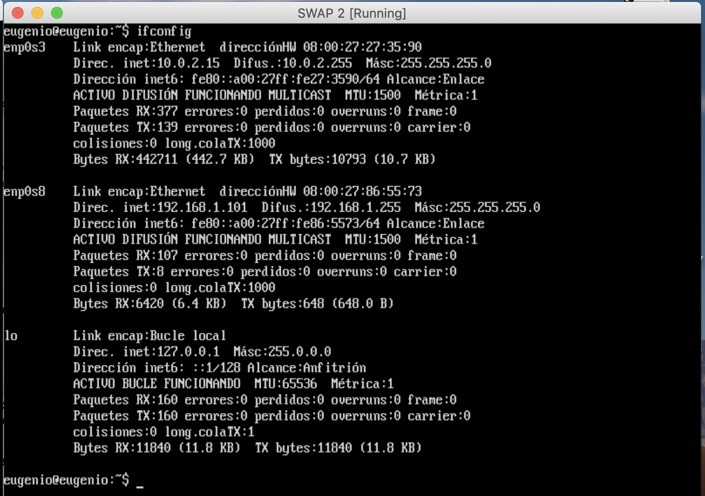
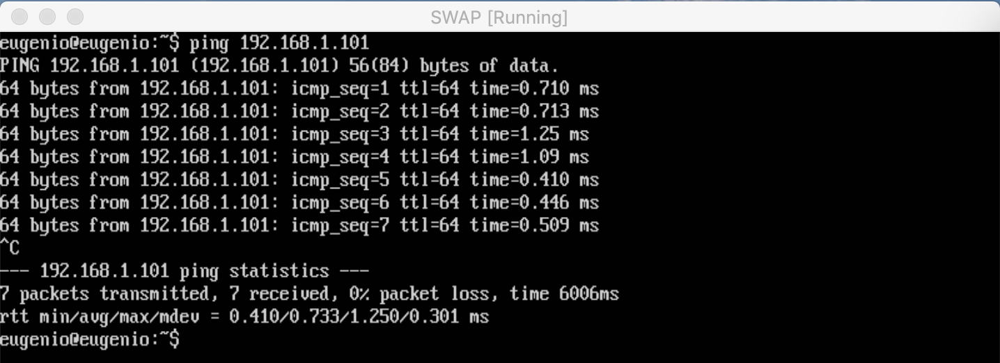
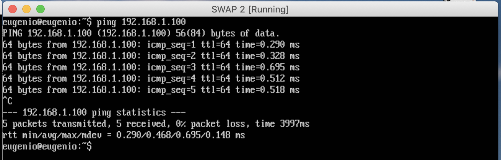
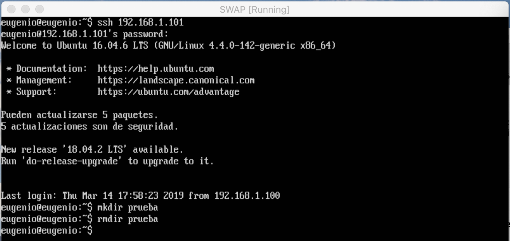
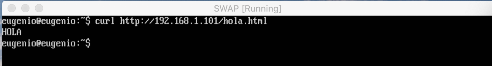
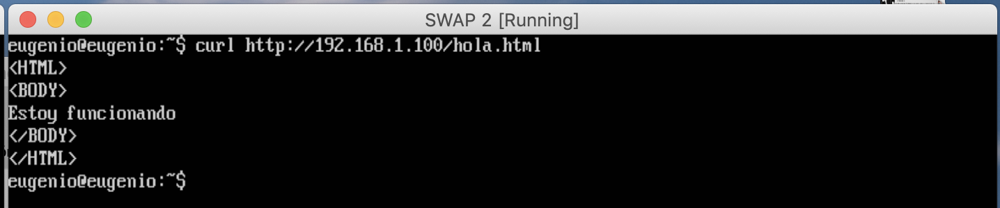

# Práctica 1
### Autores
Eugenio Alcántara García  
Pablo García Llorente

## Preparación de las herramientas
Para poder abordar la práticas debemos de realizar la instalación de Ubuntu Server 16.04 a través de VMWare o VirtualBox. Una vez hayamos seguido todos los pasos e instalado todos los paquetes necesario, podemos comenzar a realizar la práctica.  

## Cuestiones a resolver
### Direcciones IP de las máquinas virtuales
A continuación podemos ver una imagen de las direcciones IP de la máquina virtual 1:

Que en este caso la dirección IP es: 192.168.1.100 

En la sigueinte imagen podemos ver las direcciones IP de la máquina virtual 2:

 

Que en este caso la dirección IP es: 192.168.1.101 

### Hacemos PING entre las máquinas virtuales
Aquí realizamos PING de la máquina 1 a la 2:

Y aquí realizamos PING de la máquina 2 a la 1:

Como podemos comprobar en las imagénes se realiza correctamente, por lo que las máquinas virtuales están conectadas entre si.

### Acceder por SSH de una máquina virtual a otra
Como podemos ver en la imagen que se encuentra a continaución, accedemos por SSH de la máquina virtual 1 a la 2:

### Acceder mediante la herramienta cURL desde una máquina virtual a otra
Prueba de acceso mediante cURL de la máquina virtual 1 a la 2:

Prueba de acceso mediante cURL de la máquina virtual 2 a la 1:

