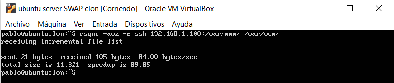
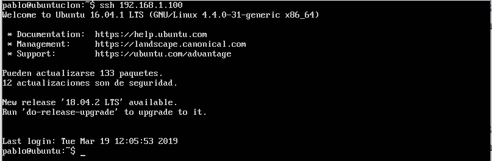
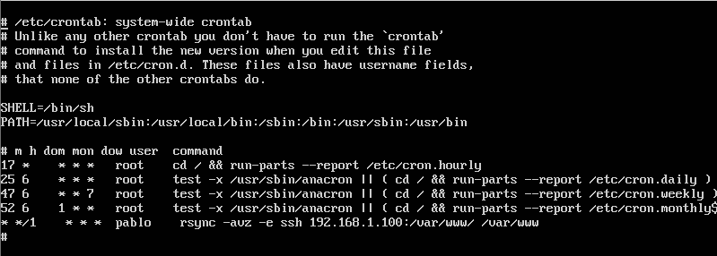

# Práctica 2
### Autores
Eugenio Alcántara García  
Pablo García Llorente

## Preparación de las herramientas
Para poder abordar la práticas debemos de realizar la instalación de la herramienta Rsync sobre las máquinas virtuales creadas a lo largo de la práctica previa, para instalar Rsync simplemente abrimos la terminal y escribimos:

      $sudo apt-get install rsync 

Una vez hayamos seguido todos los pasos e instalado todos los paquetes necesario, podemos comenzar a realizar la práctica.  

## Cuestiones a resolver

### Hay que llevar a cabo las siguientes tareas:
1. #### Probar el funcionamiento de la copia de archivos por ssh
2. #### Clonado de una carpeta entre las dos máquinas
3. #### Configuración de ssh para acceder sin que solicite contraseña
4. #### Establecer una tarea en cron que se ejecute cada hora para mantener actualizado el contenido del directorio /var/www entre las dos máquinas

### 1.Probar el funcionamiento de la copia de archivos por ssh

Para probar el funcionamiento de la copia de archivos por ssh vamos a crear un archivo directamente en otro ordenador, que en nuestro caso sería otra máquina virtual, conectado mediante ssh, más específicamente, indicaremos al comando tar que queremos que use stdout como destino y mandar con una pipe la salida al ssh. Éste debe coger la salida del tar y escribirla en un fichero. La orden sería:

    $tar czf - | ssh 192.168.1.101 'cat > ~/tar.tgz'

Ejecución de la orden, al no indicar el directorio al cual se mandará el archivo, se creará en el directorio /home/usuario del usuario que se ha utilizado para conectar el ssh, esto se ejecuta en la máquina 1 y el archivo se crea en la máquina 2:

.png.PNG)                               
_Creación de un archivo en una máquina remota mediante ssh._

Y aquí podemos ver el resultado en la máquina 2:

.png.PNG)        
_Comprobación de la creación de un archivo en una máquina remota mediante ssh._

El archivo tar.tgz se ha creado en el directorio indicado, en este caso el directorio por defecto ya que no se le indicó ningún escritorio, correctamente.

### 2. Clonado de una carpeta entre las dos máquinas

Para trabajar podemos optar por hacerlo como root o como usuario sin privilegios de root. En principio, podremos realizar todas las configuraciones como usuario sin privilegios por lo que se recomienda usar esta cuenta. En este caso se requiere que el usuario sea el dueño de la carpeta donde residen los archivos que hay en el espacio web (en ambas máquinas):

      $sudo chown pablo:pablo –R /var/www
      
Para probar el funcionamiento del rsync vamos a clonar una carpeta cualquiera. Por ejemplo, para clonar la carpeta con el contenido del servidor web principal, en la máquina 2 ejecutaremos:

      $rsync -avz -e ssh 192.168.1.100:/var/www/ /var/www/
      
Ejecución de la orden previa:

      
Nos pedirá la clave del usuario en la máquina 1, tras introducirla correctamente, podremos comprobar que el directorio /var/www queda clonado de forma idéntica en ambas máquinas:

      ls -la /var/www
      
Comprovación de la correcta clonación en la máquina 1:

.png.PNG)

Comprovación de la correcta clonación en la máquina 2:

.png.PNG)
      
      
### 3. Configuración de ssh para acceder sin que solicite contraseña

Para conectar dos equipos mediante ssh sin que requiera la contraseña se suele utilizar autenticación con un par de claves pública-privada. Mediante ssh-keygen podemos generar la clave, con la opción -t para el tipo de clave. Así, en la máquina 2 ejecutaremos:
      
      $ssh-keygen -b 4096 -t rsa

Para hacer la copia de la clave existe se utiliza el comando ssh-copy-id, que viene integrado con el comando ssh. Esto nos permitirá copiar la clave a la máquina 1, a la cual querremos acceder desde la máquina 2:

      $ssh-copy-id 192.168.1.100
      
Con esto ya podremos acceder a la máquina 1 sin utilizar contraseña como podemos ver en la imagen siguiente:

### 4. Establecer una tarea en cron que se ejecute cada hora para mantener actualizado el contenido del directorio /var/www entre las dos máquinas

Para establecer una tarea en cron, el cual es un administrador procesos en segundo plano que ejecuta procesos, se debe de modificar el fichero crontab. Cada minuto se revisa la tabla del fichero _/etc/crontab_ en búsqueda de tareas que se deban ejecutar. Podemos agregar nuevas tareas a cron para automatizar algunos procesos.

Para añadir la tarea indicada en el enunciado del problema debemos modificar el archivo _/etc/crontab_ de la siguiente manera.

La última línea del fichero mostrado en la imagen es la que hemos modificado para que se ejecute la función indicada.
