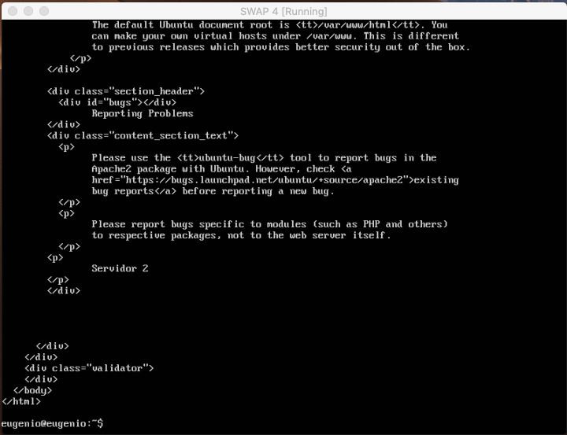

# Práctica 3
### Autores
Eugenio Alcántara García  
Pablo García Llorente

## Preparación de las herramientas

En esta práctica debemos crear una nueva máquina que funcionará como balanceador de carga, tomará las peticiones lanzadas desde una cuarta máquina y las distribuirá entre nuestras máquinas servidor que hemos creado a lo largo de las dos primeras prácticas. Con esto conseguiremos repartir el trabajo entre todas nuestras máquinas, el trabajo se puede distribuir de múltiples formas mediante diferentes algoritmos y diferentes balanceadores de carga, en esta práctica utilizaremos dos tipos NginX y HaProxy, para instalar NginX ejecutaremos las siguientes ordenes:

      $sudo apt-get update && sudo apt-get dist-upgrade && sudo apt-get autoremove
      $sudo apt-get install nginx
      $sudo systemctl start nginx

A continuación hemos hemos instalado HaProxy en la misma máquina utilizando el siguiente comando:
      
      $sudo apt-get install haproxy
      

## Cuestiones a resolver

### Hay que llevar a cabo las siguientes tareas:
1. #### Configurar una máquina e instalar el nginx como balanceador de carga
2. #### Configurar una máquina e instalar el haproxy como balanceador de carga
3. #### Someter a la granja web a una alta carga, generada con la herramienta Apache Benchmark, teniendo primero nginx y después haproxy.

### 1. Configurar una máquina e instalar el NginX como balanceador de carga

En esta práctica vamos a utilizar NginX con el objetivo de de redirigir el tráfico entre un grupo de servidores, pero para ello la configuración básica de NginX no nos sirve, para modificarla debemos acceder al fichero de configuración _/etc/nginx/conf.d/default.conf_ y debemos modificarlo como vemos a continuación:

upstream apaches {

//dirección de nuestros servidores

      server 192.168.1.100;
      
      server 192.168.1.101;
      
}
server{

      listen 80;
      
      server_name balanceador;
      access_log /var/log/nginx/balanceador.access.log;
      error_log /var/log/nginx/balanceador.error.log;
      root /var/www/;
      location /
      {
            proxy_pass http://apaches;
            proxy_set_header Host $host;
            proxy_set_header X-Real-IP $remote_addr;
            proxy_set_header X-Forwarded-For $proxy_add_x_forwarded_for;
            proxy_http_version 1.1;
            proxy_set_header Connection "";
      }
}

A continuación comprobamos el funcionamiento del balanceador mediante el uso de curl desde una cuarta máquina hacia el balanceador:

      $curl http://192.168.1.102
      $curl http://192.168.1.102
      
En la primera ejecución de la instrucción curl el servidor al cual el balanceador envía la petición es el servidor 1 mientras que la segunda petición es enviada al servidor 2 como podemos ver en las imágenes a continuación:

Primera ejecución de la instrucción curl, respondida por el servidor 1, dirección 192.168.1.100

Segunda ejecución de la instrucción curl utilizando, respondida por el servidor 1, dirección 192.168.1.101

Desde una cuarta máquina virtual hemos pedido al balanceador que nos muestre la página index.html. Puesto que nginx usa un algoritmo Round-Robin, este primero muestra el index.html del servidor 1. Si seguidamente se lo volvemos a pedir al balanceador, este mostrará el index.html del servidor 2. 

### 2. Configurar una máquina e instalar el haproxy como balanceador de carga

Tras la instalación de HaProxy debemos modificar el archivo _/etc/haproxy/haproxy.cfg_ tal como se muestra a continuación ya que la configuración que viene por defecto no nos sirve, el balanceador debe conocer la dirección de los servidores a los cuales servirá las peticiones:

global

      daemon
      maxconn 256
defaults

      mode http
      contimeout 4000
      clitimeout 42000
      srvtimeout 43000
frontend http-in

      bind *:80
      default_backend servers
backend servers

      server m1 192.168.1.100:80 maxconn 32
      server m2 192.168.1.101:80 maxconn 32
      
Vemos que nuestro balanceador espera conexiones entrantes por el puerto 80 para redirigirlas a las dos máquinas servidoras (en las que tenemos los Apache instalados y escuchando en el puerto 80).

Una vez salvada la configuración en el fichero, lanzamos el servicio haproxy mediante el comando:

      $sudo /usr/sbin/haproxy -f /etc/haproxy/haproxy.cfg
      
A continuación comprobamos el funcionamiento del balanceador mediante el uso de curl desde una cuarta máquina hacia el balanceador:

      $curl http://192.168.1.102
      $curl http://192.168.1.102
      
En la primera ejecución de la instrucción curl el servidor al cual el balanceador envía la petición es el servidor 1 mientras que la segunda petición es enviada al servidor 2 como podemos ver en las imágenes a continuación:

Primera ejecución de la instrucción curl, respondida por el servidor 1, dirección 192.168.1.100

Segunda ejecución de la instrucción curl, respondida por el servidor 2, dirección 192.168.1.101

### 3. Someter a la granja web a una alta carga, generada con la herramienta Apache Benchmark, teniendo primero nginx y después haproxy.

Mediante la herramienta top (puesta en el servidor 1, servidor 2 y balanceador) podemos ver el benchmark lanzado a través de la cuarta máquina virtual. Esto lo vamos a hacer teniendo solo activada la herramienta NginX y depués teniendo solo activada la herramienta HaProxy. Con la cuarta máquina virtual para lanzar la orden que vemos a continuación y así ver el resultando del Benchmark.

      $ ab -n 1000 -c 10 http://192.168.1.102/index.html
      
La orden anterior la lanzaremos tanto para el uso de NginX como para el uso de HaProxy.

En esta imagen podemos ver los resultado obtenido al ejercutar la Apache Benchmark teniendo activada la herramienta NginX. En la tercera máquina virtual (el balanceador) podemos apreciar que lo que más recursos está ocupando es el NginX. Mientras que tanto en la máquina virtual 1 (servidor 1), tanto como la máquina virtual 2 (servidor 2) están repartíendose la ejecuacción del Apache Benchmark gracias al balanceador. En el top figura como Apache2.  

En esta imagen podemos ver los resultado obtenido al ejercutar la Apache Benchmark teniendo activada la herramienta NginX con algunos de los pesos modificados. Este peso por defecto es de 1, esto significa que se le daría la misma carga al servidor 1 que al 2. Pero en este caso le hemos puesto el peso a 1 en el servidor 1, y 2 en el servidor 2, esto significa que la carga lanzada al servidor 2 va a ser el doble que la del servidor 1. 

En esta imagen podemos ver los resultado obtenido al ejercutar la Apache Benchmark teniendo activada la herramienta HaProxy. En la tercera máquina virtual (el balanceador) podemos apreciar que lo que más recursos está ocupando es el HaProxy. Mientras que al igual que en el NginX, tanto en la máquina virtual 1 (servidor 1), como la máquina virtual 2 (servidor 2) están repartíendose la ejecuacción del Apache Benchmark a través del balanceador. 

A lo largo de esta prática lo que hemos conseguido es balanceadar la carga de un servidor web entre dos máquinas vistuales previamente creadas. Todo esto supone un amumento concurrente del servidor y una disminución del tiempo medio de respuesta.
