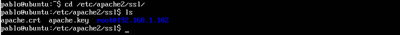

# Práctica 4
### Autores
Eugenio Alcántara García  
Pablo García Llorente

## Generar e instalar un certificado autofirmado
Lo primero que debemos hacer para generar un certificado SSL autofirmado en Ubuntu Server es activar los SSL de Apache, generar los certificados y especificar las rutas a los certificados en la confirguración. 

    $ a2enmod ssl
    $ service apache2 restart
    $ mkdir /etc/apache2/ssl
    $ openssl req -x509 -nodes -days 365 -newkey rsa:2048 -keyout /etc/apache2/ssl/apache.key -out /etc/apache2/ssl/apache.crt

Una vez hayamos introducido una serie de datos que nos pedirá al ejecutar esa última ordern, procederemos a editar el archivo de configuración del sitio default-ssl. 

    $ nano /etc/apache2/sites-available/default-ssl
    
Y le agregaremos dos nuevos cerficiados debajo de la línea donde pone SSLEngine on. 
    
    SSLCertificateFile /etc/apache2/ssl/apache.crt 
    SSLCertificateKeyFile /etc/apache2/ssl/apache.key
    
Después de haber añadido esos dos certificados, el archivo default-ssl quedaría como en la imagen de a continucación. 

Una vez guardado el archivo (siendo super usaurio), activamos el sitio default-ssl y reiniciamos apache.
        
    $ 2ensite default-ssl
    $ service apache2 reload
    
Cuando tengamos reiniciado Apache, vamos a acceder al servidor web mediante el protocolo HTTPS. Por último, como pretendemos que la granja nos permita usar el HTTPS, vamos a configurar el balanceador par que también acepte este trácfico. Para ello tendremos que copiar los archivos .crt y .key a todas las máquinas de la granja web.  

    $ sudo scp apache.crt eugenio@192.168.1.101:apache.crt 
    $ sudo scp apache.crt eugenio@192.168.1.101:apache.key
    
Esas dos líneas de comandos tendremos que lanzarlas para cada máquina virtual. En el caso del balanceador tendremos que instalar SSH previamente para poder ejecutar los comandos anteriores. Una vez hayamos ejecutado ambas órdenes, los moveremos al directorio /etc/apache2/ssl con el comando mov.

## Configuración del cortafuegos

Con la herramienta iptables podremos establecer ciertas reglas y filtrar algunos tipos de tráfico. También se podrá controlar el acceso a ciertas páginas. Para comprobar el estado del cortafuegos tendremos que ejecutar la sigueinte orden. 

    $ iptables –L –n -v
    
Al ejecutarla nos mostrará lo que podemos apreciar en la imagen de a continuación. 

Ahora vamos a proceder a abrir el puerto 22 y el 80 para permitir el acceso por SSH, en el caso del puerto 22, y HTTP para el puerto 80. Para ello tendremos ejecutar las sigueintes líneas de comandos.

    $ iptables -A INPUT -p tcp --dport 22 -j ACCEPT 
    $ iptables -A OUTPUT -p udp --sport 22 -j ACCEPT
    $ iptables -A INPUT -p tcp --dport 80 -j ACCEPT 
    $ iptables -A OUTPUT -p udp --sport 80 -j ACCEPT

Al haber ejecutado las líneas anteriores, volvemos a ver el estado del cortafuegos para ver si de verdad se ha permitido el acceso a esos puertos a través de SSH. Como podemos ver en la imagen, las instrucciones se han ejecutado correctamente. 

En el caso del HTTPS para configurar el servidor web para el puerto 443 usaríamos otra instrucción.

    $ iptables -A INPUT -m state --state NEW -p tcp --dport 443 -j ACCEPT

Y para abrir el puerto 53 para permitir el acceso a DNS:

    $ iptables -A INPUT -m state --state NEW -p udp --dport 53 -j ACCEPT 
    $ iptables -A INPUT -m state --state NEW -p tcp --dport 53 -j ACCEPT
    
Al haber ejecutado correctamente las intrucciones, al consultar el estado del cortafuegos nos quedaría de la siguiente manera.

Hemos creado un script para para que se ejecute en el arranque del sistema. Este script se puede ver a continuación. 

Para poder ejecutarlo hemos tenido que darle permisos de ejecuación mediante el comando:

    $ chmod +x /etc/activar-cortafuegos
    
A continuación, si queremos ejecutarlo durante el arranque del sistema debemos añadir el comando de ejecucción al archivo rc.local, que quedaría así.

Así es como quedaría tras el arranque del sistema. 

 

