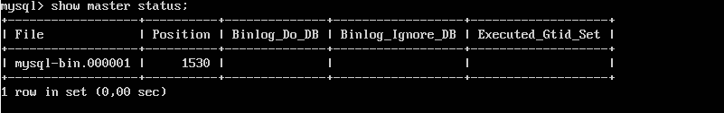
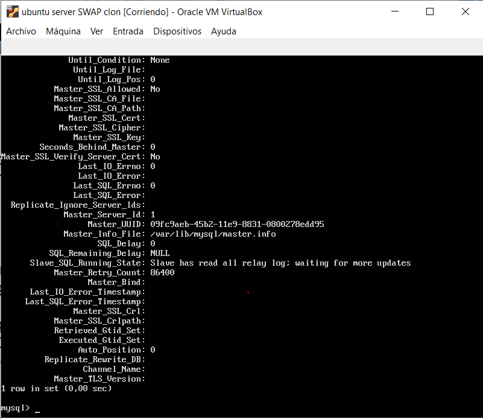

# Práctica 5
### Autores
Eugenio Alcántara García  
Pablo García Llorente

## Crear un tar con ficheros locales y copiarlos en un equipo remoto
En la práctica 2 ya vimos cómo dejar un tar.gz en un directorio y moverlo a otro mediante la herramienta SSH. Al juntarlos mediante un pipe, logramos de forma directa, obtener el tar del equipo de destino en ese caso. Esto lo que tiene que hacer es coger la salida del tar para escribirla en un fichero. Todo esto lo haríamos mediante el comando: 

    $ tar czf - directorio | ssh equipodestino 'cat > ~/tar.tgz'

## Crear una BD e insertar datos
Para seguir con la práctica, debemos de crear un base de datos en MySQL e insertarle algunos datos. Con ello tenderemos datos para poder hacer las copias de seguridad de ahora en adelante. En todo momento haremos uso de la interfaz de línea de comandos de MySQL. Para poder iniciar esta línea de comandos escribiremos el comando:

    $ mysql -u root -p
    
Una vez estemos dentro de la interfaz de línea de comandos MySQL, vamos a crear nuestra base de datos llamada "datos" e insertarle datos (un registro) en el interior de esta. Todo esto lo hemos hecho con los siguientes comandos de la línea de comandos de MySQL. 

    $ mysql> create database contactos;
    $ mysql> use contactos;
    $ mysql> create table datos(nombre varchar(100),tlf int);
    $ mysql> insert into datos(nombre,tlf) values ("pepe",95834987);
    
Para poder comprobar que todo está correcto podríamos hacer uso del comando:

    $ mysql> select * from datos;
    
        

## Replicar una BD MySQL con mysqldump
La herramienta mysqldump, ofrecida por MySQL, nos permite clonar la base de datos que tenemos en nuestra máquina. Esta herramienta forma parte de los programas del cliente MySQL y se pude hacer uso de ella para hacer copias de seguridad de la base de datos. Pero antes de hacer uso de esta herramienta, tendríamos que tener en cuenta que los datos pueden estár actualizándose constantemente en el servidor de BD de datos principal. Por ello vamos a evitar que se acceda a la BD para cambiar nada, antes de hacer la copia de seguridad en el archivo .SQL. 

Máquina 1:

    $ mysql -u root –p
    $ mysql> FLUSH TABLES WITH READ LOCK;
    $ mysql> quit
    
Con ello lo que habremos hecho es bloquear las tablas de la máquina 1. Por lo que ya podremos proceder a usar mysqldump para guardar los datos. 

Máquina 1:
    
    $ mysqldump contactos -u root -p > /tmp/contactos.sql
    
Después de usar la orden anterior, ya sí podemos desbloquear las tablas. 

Máquina 1:

    $ mysql -u root –p
    $ mysql> UNLOCK TABLES; 
    
Ahora ya podemos ejecutar la copia de seguridad en la máquina 2. 

Máquina 2:

    $ scp 192.168.1.100:/tmp/contactos.sql /tmp/
    
Al haber ejecutado el comando anterior, ya tendremos el archivo en la máquina 2 y podemos importar la base de datos completa en el MySQL. Para ello creamos la BD con las líneas de comando de a continuación. 

Máquina 2: 

    $ mysql -u root –p
    $ mysql> CREATE DATABASE ‘contactos’;
    
Ahora vamos a restaurar los datos contenidos en la base de datos. 

    $ mysql -u root -p contactos < /tmp/contactos.sql 

## Replicación de BD mediante una configuración maestro-esclavo
A pesar de que lo realizado anteriormente funciona perfectamente, es realizado por un operador a mano, por lo que no es muy eficiente. Por suerte MySQL tiene la opción de hacer uso de un proceso automático. A nivel de un entorno de producción real, resulta muy adecuado.  

Para poder hacer uso de este proceso, lo primero que tendremos que hacer es la configuración de mysql del maestro. Siendo usuario root, vamos a editar el archivo /etc/mysql/mysql.conf.d/mysqld.cnf. Las modificaciones que tenemos que realizar a contianuación:

    # bind-address 127.0.0.1
    server-id = 1
    
Guardamos las modificaciones realizadas y reinciamos el servicio:

    $ /etc/init.d/mysql restart
    
Para la máquina 2 realizamos los mismos cambios pero cambiando server-id = 1, por server-id = 2. Ahora entramos en la línea de comandos de MySQL y ejecutamos las sigueintes sentencias en la máquina 1. 

Máquina 1:

    mysql> CREATE USER esclavo IDENTIFIED BY 'esclavo';
    mysql> GRANT REPLICATION SLAVE ON *.* TO 'esclavo'@'%' IDENTIFIED BY 'esclavo';
    mysql> FLUSH PRIVILEGES;
    mysql> FLUSH TABLES;
    mysql> FLUSH TABLES WITH READ LOCK;
    
Para terminar la configuación de esta máquina, obtenemos los datos de la BD: 

    mysql> SHOW MASTER STATUS;
    
 

Ahora en la línea de comandos de MySQL en la máquina 2, le damos los datos de la máquina 1. Para darle los datos ejecutamos la siguiente instrucción:

    mysql> CHANGE MASTER TO MASTER_HOST='192.168.1.100', MASTER_USER='esclavo', MASTER_PASSWORD='esclavo',         MASTER_LOG_FILE='mysql-bin.000001', MASTER_LOG_POS=1530, MASTER_PORT=3306;
    
Y ahora ejecutamos el comando:

    mysql> START SLAVE;
    
Por último volvemos a la máquina 1 y ejecutamos:

    mysql> UNLOCK TABLES;
    
Pero cuando fuimos a comprobar que todo funcionaba correctamente, utilizando el comando:

    mysql> SHOW SLAVE STATUS\G
    
Nos dió el fallo 1593:

    Last_IO_Errno: 1593
    Last_IO_Error: Fatal error: The slave I/O thread stops because master and slave have equal MySQL server ids; these ids  must be different for replication to work (or the --replicate-same-server-id option must be used on slave but this does not always make sense; please check the manual before using it).
    
Para solucionarlo fuimos a la carpeta /var/lib/mysql y eliminamos el archivo auto.cnf en la máquina 2. Este archivo se vuelve a crear cuando ejecutamos la orden:

     mysql> CHANGE MASTER TO MASTER_HOST='192.168.1.100', MASTER_USER='esclavo', MASTER_PASSWORD='esclavo',         MASTER_LOG_FILE='mysql-bin.000001', MASTER_LOG_POS=1530, MASTER_PORT=3306;
     
Y ya obtenemos el siguiente status:
 
 

Para comprobar que todo funciona, hemos añadido 2 filas en la máquina 1:

Y cuando ejecutamos en la máquina 2:

    $ mysql> select * from contactos.datos;   
   
Obtenemos el siguiente resultado:

    
