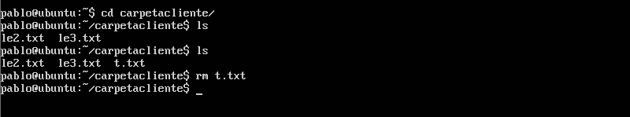
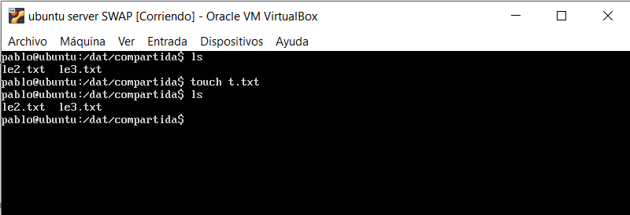

# Práctica 6
### Autores
Eugenio Alcántara García  
Pablo García Llorente

## Configurar el servidor NFS
Vamos a proceder a configurar un servidor NFS con el fin de exportar un espacio en disco a los servidores finales. Los cuales actuarán como clientes-NFS.

Para comenzar instalaremos las herramientas que vamos a necesitar en el servidor. Para instalarlas haremos uso de la orden:

    $ sudo apt-get install nfs-kernel-server nfs-common rpcbind
    
Ahora crearemos la carpeta que vamos a compartir posteriormente. Además cambiaremos el propietario y los permisos de la carpeta. Todo ello lo haremos ejecutando las siguientes 3 instrucciones:

    $ mkdir /dat/compartida
    $ sudo chown nobody:nogroup /dat/compartida/ 
    $ sudo chmod -R 777 /dat/compartida/
    
Debemos editar el archivo de configuración /etc/exports. Lo que vamos a hacer es dar permisos de acceso a las máquinas clientes, esto lo vamos a hacer añadiendo las IPs correspondientes. 

    /dat/compartida/ 10.10.10.9(rw) 10.10.10.10(rw)
    
Una vez hayamos hecho todo lo anterior, procederemos a reiniciar el servicio.

    $ sudo service nfs-kernel-server restart

    
## Configurar los clientes
Ahora tenemos que trabajar con las máquinas de los clientes. De modo que vamos a instalar una serie de paquetes necesarios y crear el punto de monataje de las máquinas 1 y 2.

    $ sudo apt-get install nfs-common rpcbind 
    $ cd /home/usuario
    $ mkdir carpetacliente
    $ chmod -R 777 carpetacliente

Como se puede apreciar, funciona correctamente. Ahora podemos proceder a montar la carpeta remota (la exportada en el servidor). Esto lo haremos con la instrucción:

    $ sudo mount 10.10.10.13:/dat/compartida carpetacliente
    
Después comprobaremos que se puede leer y escrbir los archivos que tenemos almacenados en la caprpeta compartida. Finalmente en el archivo /etc/fstab vamos a introducir la línea de a continuación para que esta configuración se quede de forma permanente.

    
    10.10.10.13:/dat/compartida /home/usuario/carpetacliente/ nfs auto,noatime,nolock,bg,nfsvers=3,intr,tcp,actimeo=1800 0 0
Como podemos ver en esta ltima imagen, el servidor funciona de forma correcta. 

    
